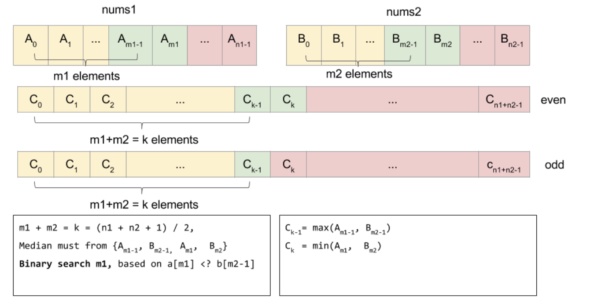

## 004 Median of Two Sorted Arrays [hard]

> 给定两个有序数组nums1和nums2，长度分别是m和n。找出它们合并后的中位数。

> eg:  
  nums1 = [1, 3]
  nums2 = [2]
  The median is 2.0

*你的算法时间复杂度应该为O(log(m+n)), nums1和nums2保证不同时为空*

#### Solution：
> 直接合并(类似归并排序的一轮)，再找第(m+n)/2位置的时间复杂度为O(min(m, n))，不满足要求
 
> **BinarySearch or Divide&Conquer**

##### Method 1

> BinarySearch

> * m1是满足m1+m2=k且nums1[m1]>=nums2[m2-1]的最小下标
> * $nums1[m1-1]<nums2[m2]$, $nums2[m2-1]<=nums1[m1]$
> nums1的前m1-1个和nums2的前m2-1个一定在nums1[m1]和nums2[m2]之前，共计m1+m2-2=k-2个
> * $C_{k-1}=max(A_{m1-1}, B_{m2-1})$, 
> $C_{k}=min(A_{m1}, B_{m2})$
> 对于n1+n2为奇数，则第k个数$C_{k-1}$就是中位数
> 否则，中位数=$\frac{C_{k-1}+C{k}}{2}$
> * m1的初始取值范围[0,n1], 0和n1是边界值，分别意味着nums1全部都不用/用;


* Time Complexity: $O(log(min(m,n)))$
* Space Complexity: $O(1)$

#### Code:

```cpp
class Solution {
public:
    double findMedianSortedArrays(vector<int>& nums1, vector<int>& nums2) {
        const int n1 = nums1.size();
        const int n2 = nums2.size();
        if (n1 > n2) return findMedianSortedArrays(nums2, nums1);
        const int k = (n1 + n2 + 1) / 2;
        int l = 0, r = n1;
        while (l < r) {
            const int m1 = l + (r - l) / 2;
            const int m2 = k - m1;
            if (nums1[m1] < nums2[m2 - 1])
                l = m1 + 1;
            else
                r = m1;
        }
        
        const int m1 = l;
        const int m2 = k - l;
        const int c1 = max(m1 <= 0 ? INT_MIN : nums1[m1 - 1],
                           m2 <= 0 ? INT_MIN : nums2[m2 - 1]);
        
        if ((n1 + n2) % 2 == 1)
            return c1;
        
        const int c2 = min(m1 >= n1 ? INT_MAX : nums1[m1],
                           m2 >= n2 ? INT_MAX : nums2[m2]);
        return (c1 + c2) * 0.5;
    }
};
```


---

##### Method 2
> Divide&Conquer
> 把问题规约为寻找nums1和nums2合并后数组的第K大元素，则中位数为K=(m+n+1)/2
> 定义问题为寻找nums1[i:]和nums2[j:]合并后的数组的第K大元素，对K二分
> 如果K=1，则为min(nums1[i], nums2[j])
> 否则，将K二分为K/2,如果nums1[i+K/2-1] < nums2[j+K/2-1]，则显然nums1[i:i+K/2]都不可能是第K大元素，因为第K大元素需要K-1个元素比它小，而可能比nums1[i+K/2-1]小的只有nums1[i:i+K/2-1]的K/2-1个和nums2[j:j+K/2-1]的K/2-1个，总共才K-2个，所以可以直接将i移到i+K/2，此时K-=K/2。


* Time Complexity: $O(log(m+n))$
* Space Complexity: $O(1)$

#### Code:
```cpp
class Solution {
public:
    const int inf = 0x3f3f3f3f;
    
    // [l, r) 寻找单个数组的第K大
    int get_kth_of_single(vector<int>& nums, int l, int K) {
        size_t r = nums.size();
        if (K > r - l) return inf;
        return nums[l + K - 1];
    }
    // 寻找nums1和nums2合并后数组的第K大
    int get_kth_of_double(vector<int>& nums1, vector<int>& nums2, int K) {
        size_t m = nums1.size(), n = nums2.size();
        int i = 0, j = 0;
        if (!m) return nums2[K - 1];
        if (!n) return nums1[K - 1];
        while (K > 1) {
            int half_K = K / 2;
            int mid1 = get_kth_of_single(nums1, i, half_K),
                mid2 = get_kth_of_single(nums2, j, half_K);
            if (mid1 < mid2) {
                i += half_K;
            } else {
                j += half_K;
            }
            K -= half_K;
        }
        // K = 1
        return min(i >= m ? inf : nums1[i], j >= n ? inf : nums2[j]);
    }
    
    double findMedianSortedArrays(vector<int>& nums1, vector<int>& nums2) {
        static auto x=[](){
            std::ios::sync_with_stdio(false);
            cin.tie(nullptr);
            return nullptr;
        }();

        size_t m = nums1.size(), n = nums2.size();
        int K1 = (m + n + 1) / 2, K2 = (m + n + 2) / 2;
        int V1 = get_kth_of_double(nums1, nums2, K1);
        if ((m + n) % 2) return V1;
        int V2 = get_kth_of_double(nums1, nums2, K2);
        return (V1 + V2) * 0.5;
    }
        
};
```
#### Summary:
1. 根据时间复杂度倒推应该使用的算法，本题要求log时间复杂度，不难想到二分、分治等方法。
2. 有时把问题规约到一个条件更多，但是更难的问题上，反而更容易思考。

#### Tricks:
1. 求长度为n的数组的中位数，如果n是奇数，则是第$\frac{n+1}{2}$个元素，如[1, 2, 3]就是第2个元素2；如果n是偶数，则是第$\frac{n+1}{2}$个元素和第$\frac{n+2}{2}$个元素的平均。但是因为n是奇数时，$\frac{n+2}{2}$和$\frac{n+1}{2}$相等，所以$\frac{n+1}{2}$和第$\frac{n+2}{2}$的平均是通用的（无论n是奇是偶）
